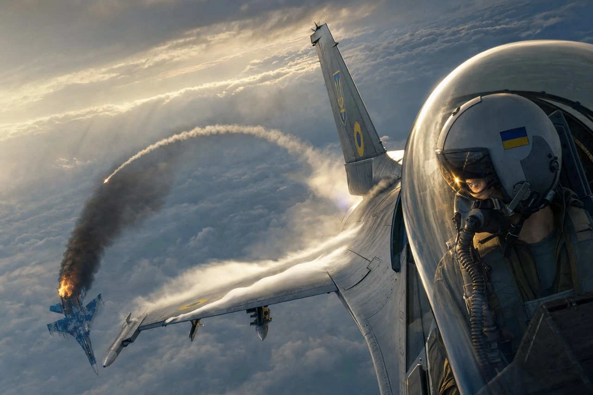
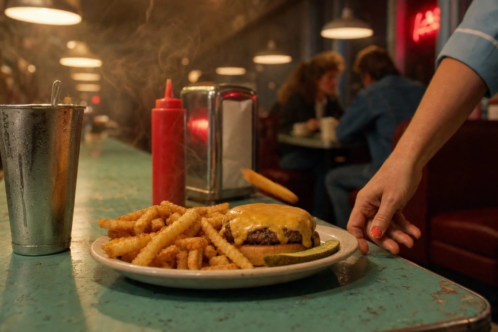
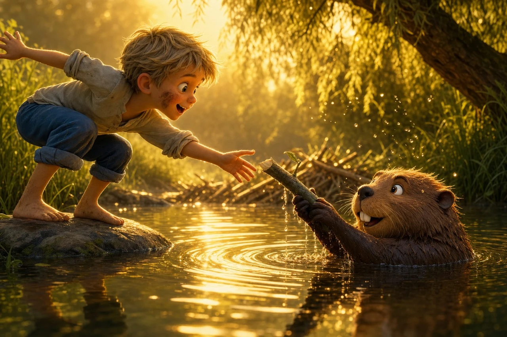

# 🎬 Cinematic Frame Director

[](https://claude.com/claude-code)
[](LICENSE)
[](https://github.com/artnebo/cinematic-frame-director/releases)
[](https://github.com/artnebo/cinematic-frame-director/pulls)

A [Claude Code](https://claude.com/claude-code) skill that turns any idea — a sentence, a mood, a half-formed image in your head — into **one production-grade cinematic image prompt** for text-to-image models: **Seedream, Midjourney, Flux, DALL·E, Stable Diffusion**, and any other AI image generator.

Not a prompt template. A director.

## Gallery

Real frames generated from single-sentence requests, directed by this skill:

<table>
  <tr>
    <td width="50%">
      
      <br /><sub><b>"A dogfight scene in modern-blockbuster style"</b> — the frame freezes the second <i>after</i> the win: missile trail still hanging, the pilot's head turned to check the kill.</sub>
    </td>
    <td width="50%">
      
      <br /><sub><b>"A diner shot focused on the food, 80s TV-series style"</b> — prefix re-voiced to 35mm Eastman grain and tungsten practicals; the plate has just slid to a stop.</sub>
    </td>
  </tr>
  <tr>
    <td width="50%">
      
      <br /><sub><b>"A cartoon about a beaver and his friend, a scene on the river"</b> — prefix adapted to feature animation; frozen one centimeter before paw meets hand.</sub>
    </td>
    <td width="50%">
      
      <br /><sub><b>"A girl in the Maldives at sunset"</b> — not a posed portrait: mid-stride, spray frozen mid-arc, eye-line landing just past the camera at whoever follows.</sub>
    </td>
  </tr>
</table>

## What it does

You give it an idea in any language:

```
/cinematic-frame-director a girl comes home late in the rain, her boyfriend is waiting
```

It answers like a film director, not a keyword generator:

1. **Finds the decisive moment** — freezes the frame just before or just after the obvious beat, where the tension lives. The punch about to land beats the punch landing.
2. **Blocks the mise-en-scène** — geo-spatial positions of every character and object, what hands are doing, what's between people.
3. **Directs the acting** — Hollywood restraint: micro-expressions, precise eye-lines, bodies caught mid-motion or mid-breath, never posed.
4. **Chooses the camera** — specific lens, height, angle, focus plane, and *why* the camera is there.
5. **Lights the frame** — named light sources, contre-jour by default, and a 60:30:10 color budget.
6. **Delivers exactly one copy-ready prompt** in English, in a strict structure:

```
[STYLE PREFIX — locked look: film still, natural light, color budget, physics, composition]

Characters:
[Vivid anchors — visible state only: wet hair, chipped nail polish, mid-inhale]

Scene:
[Where, when, geo-spatial blocking of everyone and everything]

Frame:
[The single frozen millisecond: lens, angle, what's mid-motion,
 eye-lines, light direction, what's sharp, what melts into bokeh,
 where the composition pushes the eye]
```

The Style Prefix adapts when the idea demands it — a 1980s TV-series diner gets 35mm Eastman grain and tungsten practicals, an animated scene gets a Pixar-grade prefix, an Apple-keynote scene gets precision stage lighting. The look is a language, not a cage.

## Example

**Input (12 words):** *"a girl comes home late in the evening in the rain, her boyfriend is waiting"*

**Output (fragment):**

> *Frame:*
> *Wide 35mm from inside the room at seated eye level, Marco's shoulder soft in the right foreground, Anna sharp in the doorway on the left third. She is caught mid-motion closing the door with her back, eyes down at the floor, one drop of water falling from her coat hem with faint motion blur. Marco's eyes have just found her — head tilted a few degrees, mouth still, thumb holding his place in the book. Contre-jour rain-blue street light silhouettes her and hazes the doorway; that cold blue owns 60% of the frame, the room's dim neutrals 30%, and the last warm sliver of a hallway bulb behind her shoulder is the 10% accent. […] Negative space between them stretched across the rule-of-thirds grid — the twelve feet of floor is the subject.*

## Install

**Claude Code (personal skills):**

```bash
git clone https://github.com/artnebo/cinematic-frame-director.git
cp -r cinematic-frame-director/cinematic-frame-director ~/.claude/skills/
```

Then in any session:

```
/cinematic-frame-director your idea in any language
```

Or just describe the image you want — the skill triggers automatically on requests like "image prompt", "cinematic frame", "movie still of…", in any language.

**Project-level:** copy the `cinematic-frame-director/` folder into your repo's `.claude/skills/` instead.

## Principles baked in

- **One prompt, one frame.** Never scenes, cuts, or sequences — if the idea is a story, it freezes the single most charged instant.
- **The frame must be mid-motion.** A falling drop, a half-step, a breath — if it reads like a posed portrait, it failed.
- **Evidence over exposition.** Wet footprints, an untouched plate, a book gone still — the frame implies the time around it.
- **English prompts, any input language.** Talks to you in your language, directs in English.
- **Full re-delivery on revisions.** "Make it night" returns the complete updated prompt, copy-ready.

## Adaptive style

The Style Prefix is a look, not a cage. Real outputs from this skill have re-voiced it per genre while keeping the directing machinery intact:

| Request | Prefix adaptation |
|---|---|
| Cartoon scene | Pixar-grade 3D feature-animation still, groomed fur, subsurface scattering |
| 1980s TV series diner | 35mm Eastman grain, halation, tungsten practicals, neon accent |
| Modern action blockbuster | Top Gun: Maverick aerial-unit realism, chase-plane long lens |
| Apple-keynote product shot | Precision stage lighting, LED screen as key light, theatrical haze |
| Documentary | Cinéma vérité handheld, available fluorescent light, stolen framing |

## Origin

The directorial approach (style prefix, mise-en-scène blocking, Hollywood-restraint acting, motivated camera, 60:30:10 lighting) is adapted from a Seedance 2.0 video shotlist workflow, re-focused from 15-second multi-cut clips down to a single decisive still frame.

## Contributing

Issues and pull requests are welcome — especially new worked examples, genre-specific style prefixes, and refinements to the directing guidance in [`SKILL.md`](cinematic-frame-director/SKILL.md).

## License

[MIT](LICENSE)
